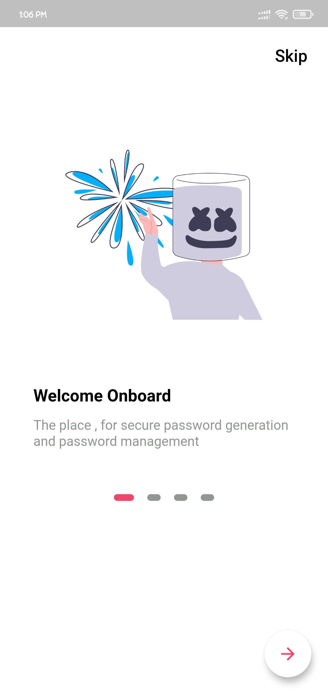
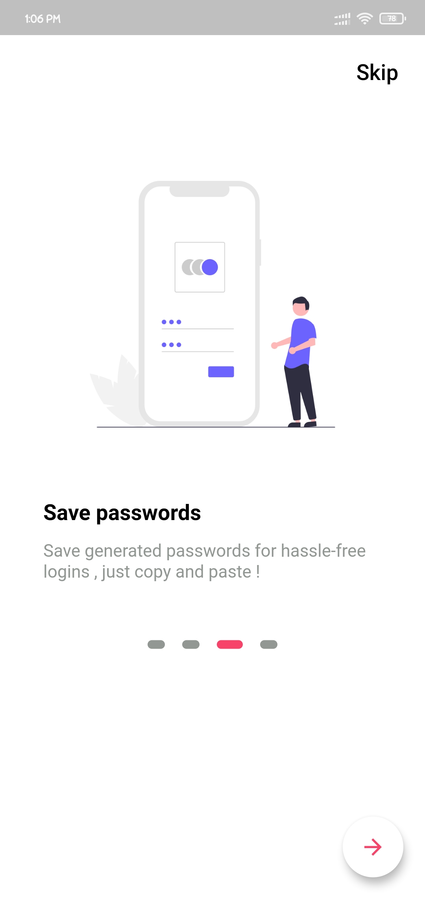
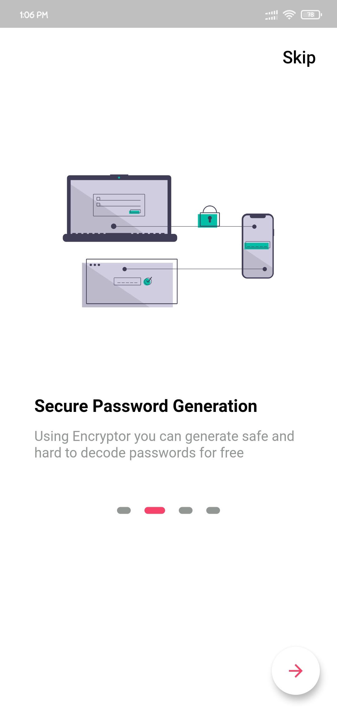
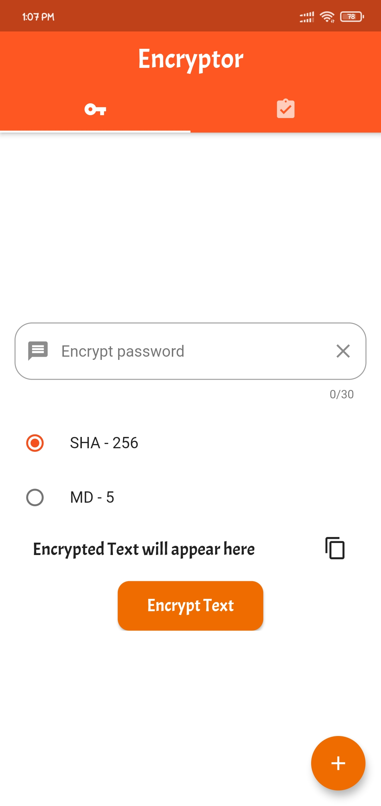
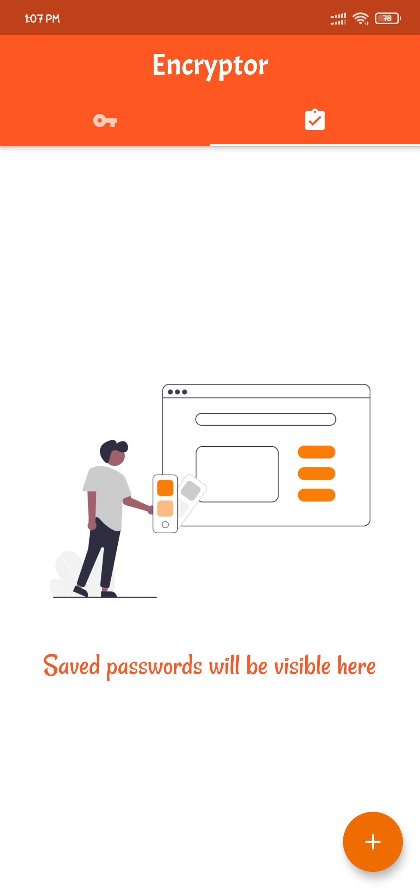
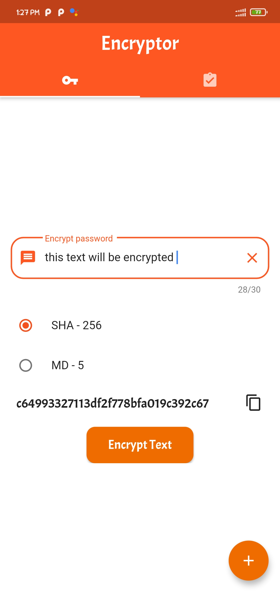
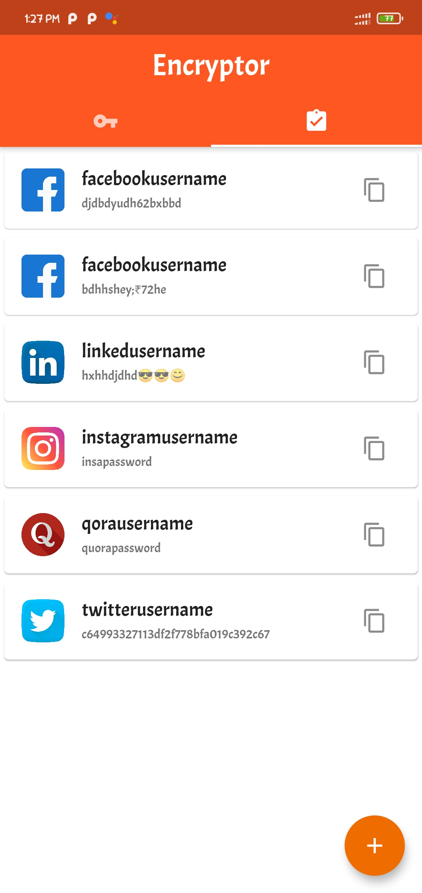

# encryptor :tada:
Secure Password generation App made using Flutter , user can generate fully encrypted password string using SHA-256 or MD-5 algorithms in app and can save the username and password so that it can be used later-on .

## How to setup the build ?
Clone the repo using the git clone
```
$git clone https://github.com/avijeetpandey/encryptor.git
```
cd into encryptor and run the following command
```
cd encryptor
flutter run
```

This will setup , build and launch the app in emulator or in physical device 

## Features
- User can encrypt the string using one of the cryptographic algorithms and can copy the content to the clipboard
- user can save the username and generated password permanently into the database and can copy the password for usage anytime


## App UI ( Onboarding and Different Screens)
**Onboarding Screens**<br>




**App Screens**<br>
 





### Made with ❤ by Avijeet , Using Flutter :tada: